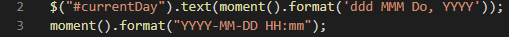
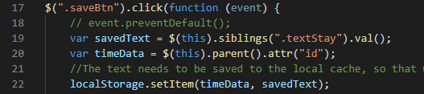
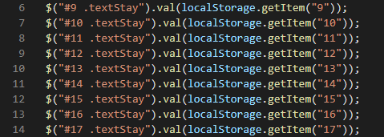
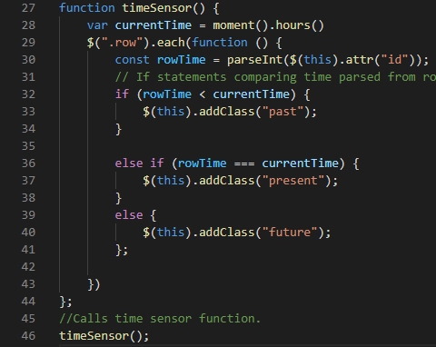

# Day_Planner
Creation of a day planner using jQuery.  The planner should be able to save whatever input into the text field for each hour using the save button on the right.  The text area will also have different background colors depending on if the time has past (grey), is in the current hour (red), or is yet to come (green).

## Step By Step:

### Javascript/jQuery:

- Lines 2-3: Hooking into Moment.js API for a clock.

- Lines 17-22: Created a click event that saves the values put into the text area into local storage.

- Lines 6-14: Created get methods for the local storage.

- Lines 27-44: Created the timeSensor Function.  This function is responsible for the color indications of whether something needs to be done in the day or not.  It does so by using if statements to compare the time input in the left columns to the clock grabbed from Moment.js, which would be the current time.

- Line 46: timeSensor function is called.

### HTML & CSS:

- Lines 22: Created a container using bootstrap.

- Lines 32-76: Created 9 rows for hours 9am-5pm. Each row contains 3 columns: one for the time, another for text input by the user, and another for a save button that will save the user's input.

- Rows: Have an id equivalent to the time of day.

- Column 1: hooked the given CSS of "time-block" and "hour"

- Column 2 (Textarea): swapped from divs to match the semantic given in the CSS as well as giving the user a place to input info.  Also created a class of textStay which plays a role in grabbing the user input and saving it to the local cache.

- Column 3: add saveBtn and btn-secondary classes to make responsive buttons.

  https://aisayyid.github.io/Day_Planner/

